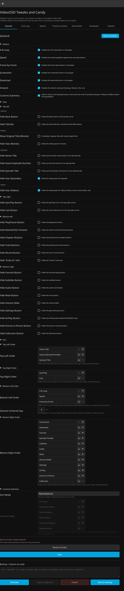
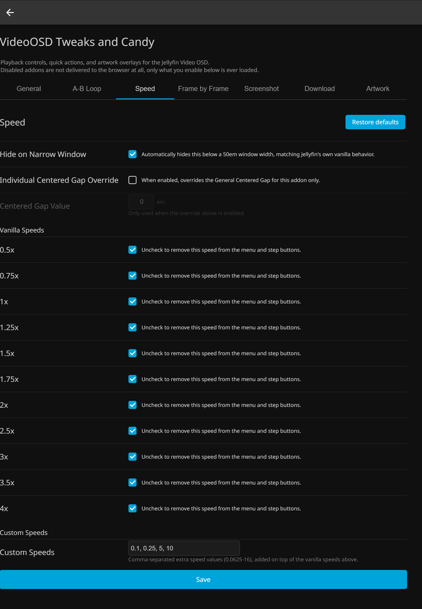
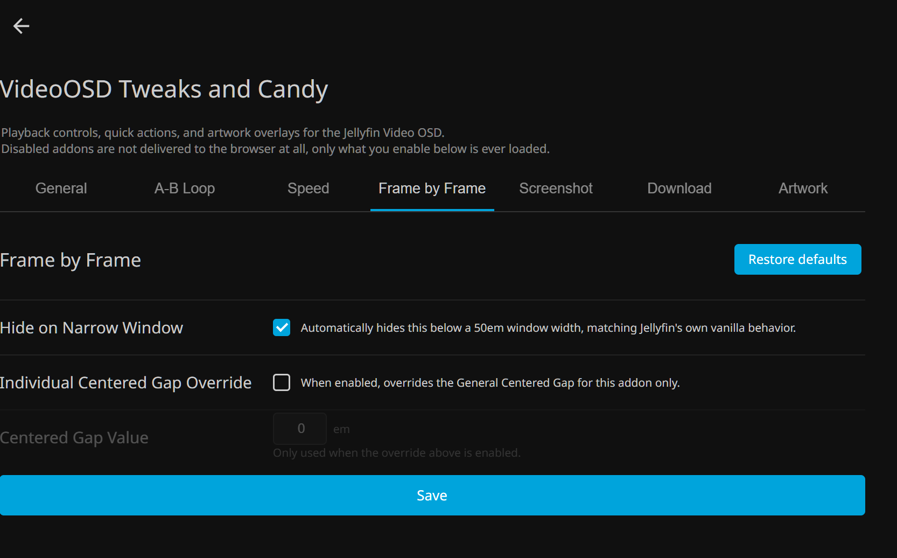
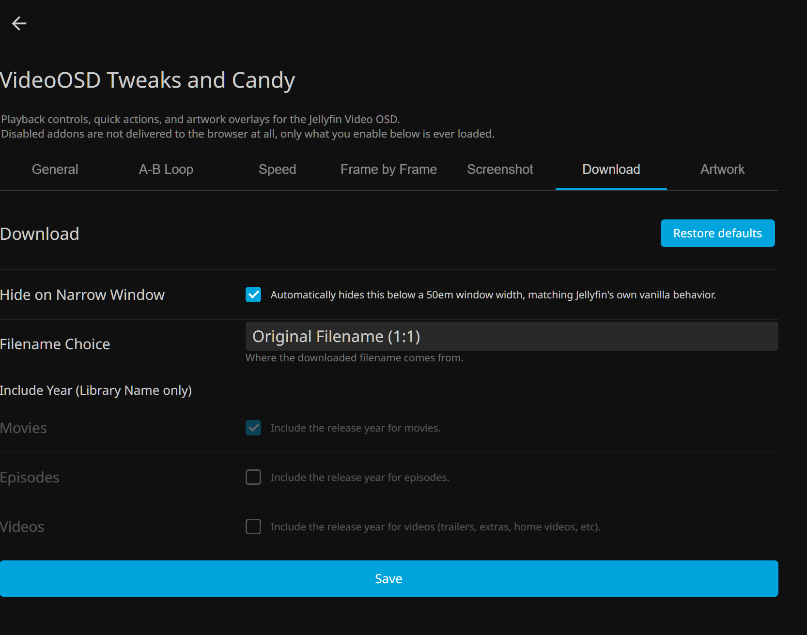
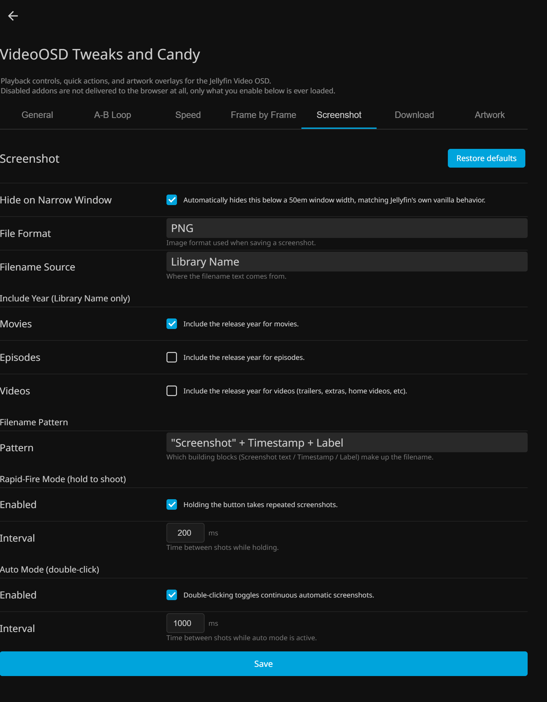
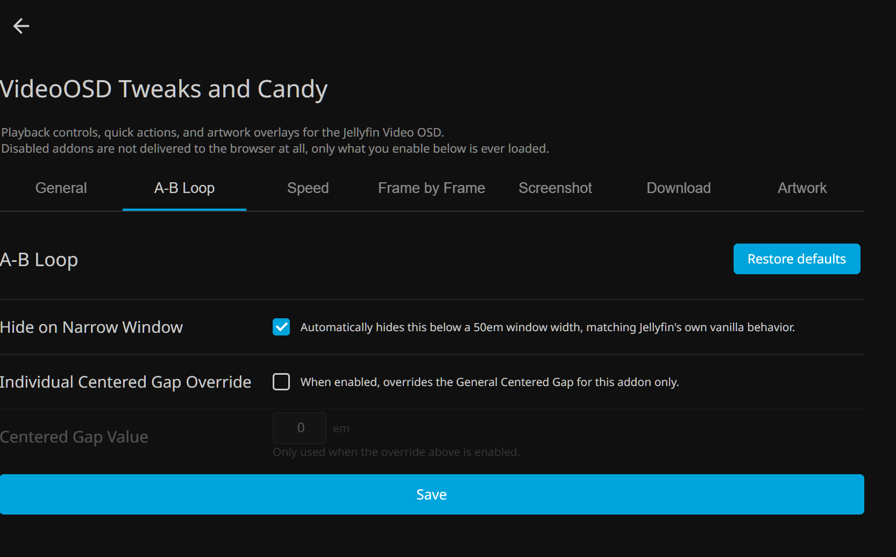
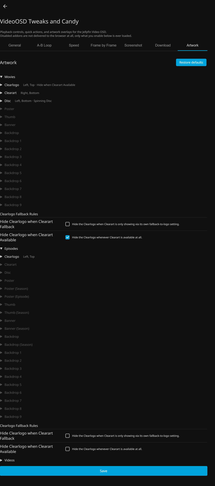

[Jellyfin Projects](https://linktr.ee/JellyfinProjects) | [Kodi Projects](https://linktr.ee/KodiProjects)

---

*Not affiliated with or endorsed by Jellyfin.*

---

# VideoOSD Tweaks and Candy

- [What This Is](#what-this-is)
- [What This Is Not](#what-this-is-not)
- [General Tweaks](#general-tweaks)
  - [On/Off](#onoff)
  - [Hide](#hide)
  - [Sort](#sort)
- [Custom Tweaks](#custom-tweaks)
  - [Custom On/Off Menu](#custom-onoff-menu)
  - [Custom Playback Speed Buttons](#custom-playback-speed-buttons)
  - [Custom Playback Speed Menu](#custom-playback-speed-menu)
  - [Frame-by-Frame Buttons](#frame-by-frame-buttons)
  - [Download Button](#download-button)
  - [Screenshot Button](#screenshot-button)
  - [A-B Loop Button](#a-b-loop-button)
- [Candy](#candy)
  - [Artwork Display](#artwork-display)
- [Installation](#installation)
- [Settings Not Applying?](#settings-not-applying)
- [Tested On](#tested-on)
- [License](#license)

---

This plugin grew out of my [Jellyfin VideoOSD Projects](https://github.com/chrissix666/Jellyfin-VideoOSD-Projects-Overview), a collection of standalone scripts for the Jellyfin video OSD. The scripts continue to work independently via JavaScript injector.

VideoOSD Tweaks and Candy brings everything together in one Jellyfin plugin, and adds a layer of control over the vanilla OSD that was not possible before: hide individual elements, reorder them across all four zones, and shape the OSD exactly the way you want it. On top of that, eight optional addons extend the player with features familiar from VLC and beyond. And then there is the Candy.

---

## What This Is

The Jellyfin video OSD is functional, but fixed. You get what Jellyfin gives you, in the order Jellyfin decided.

VideoOSD Tweaks and Candy changes that. Every vanilla OSD element can be individually hidden or repositioned across four independent zones: top left, top right, bottom left, and bottom right. No compromise layout, no living with buttons you never use.

On top of that, eight optional addons bring the controls you actually want: playback speed steps, frame-by-frame navigation, A-B loop, quick download, screenshots, and a Custom On/Off Menu to toggle all of it without leaving the video. Think of it as a VLC crossover for the Jellyfin OSD, extended with things VLC never had.

And then there is the Candy. Artwork Display overlays your library artwork directly onto the OSD during playback. Fully configurable down to the smallest detail.

---

## What This Is Not

VideoOSD Tweaks and Candy is not a skin, not a theme, not a custom player, not a replacement for Jellyfin Web, not standalone CSS, and not a frontend of its own.

It is a plugin that sits on top of vanilla Jellyfin Web and builds on it. The OSD still looks and feels like Jellyfin. Everything is native, just packed with features, customization, and control that vanilla does not offer out of the box.

---

## General Tweaks

Hide or reorder any vanilla Jellyfin OSD element independently across all four zones. Each zone is configured separately through the admin dashboard.

- **Top Left:** title bar elements - back button, title, year, series info
- **Top Right:** sync play and cast buttons
- **Bottom Left:** playback controls and custom addons, sortable among each other when multiple are enabled
- **Bottom Right:** vanilla elements and custom addons sorted together in one unified order, including full compatibility with the Episode Preview addon

Full freedom, no tradeoffs.

---

### On/Off

Control which custom addons are active. Enable or disable each one independently. Disabled addons are not delivered to the browser at all, so only what you actually use is ever loaded.

- A-B Loop
- Speed
- Frame by Frame
- Screenshot
- Download
- Artwork
- Customs Submenu

---

### Hide

Vanilla OSD elements only. Hide individual buttons, labels, and controls across all four zones without touching anything else. The rest of the OSD stays exactly as Jellyfin intended it.

**Top Left**

- Hide Back Button
- Hide Title Bar
- Show Original Title (Movies)
- Hide Year (Movies)
- Hide Series Title
- Hide Season/Episode Number
- Hide Episode Title
- Hide Year (Episodes)
- Hide Year (Videos)

**Top Right**

- Hide SyncPlay Button
- Hide Cast Button

**Bottom Left**

- Hide Play/Pause Button
- Hide Rewind/Fast Forward
- Hide Chapter Buttons
- Hide Track Buttons
- Hide Record Button
- Hide "Ends At" Info

**Bottom Right**

- Hide Favorite Button
- Hide Subtitles Button
- Hide Audio Button
- Hide Mute Button
- Hide Volume Slider
- Hide Settings Button
- Hide AirPlay Button
- Hide Picture-in-Picture Button
- Hide Fullscreen Button

---

### Sort

Reorder both vanilla elements and custom addons across all four zones. Each zone has its own independent order.

- **Top Left:** reorder title bar elements among each other
- **Top Right:** reorder the available top right buttons
- **Bottom Left:** sort your custom addons among each other
- **Bottom Right:** vanilla elements and custom addons in one unified sortable list, including Episode Preview addon compatibility

- Top-Left Order
- Top-Right Order
- Bottom-Left Order
- Bottom-Right Order

---

## Custom Tweaks

---

### Custom On/Off Menu

A quick-switch submenu directly inside the playback settings. Toggle any addon on or off without leaving the video.

---

### Custom Playback Speed Buttons

Step up and down through playback speeds directly from the OSD. A center field shows the current speed and resets to 1x on click. Uses your own custom speed values when the Speed Menu is installed, falls back to Jellyfin vanilla speeds otherwise.

**Settings**

- Hide on Narrow Window
- Individual Centered Gap Override
- Centered Gap Value

**Vanilla Speeds** (enable or disable each individually):

- 0.5x, 0.75x, 1x, 1.25x, 1.5x, 1.75x, 2x, 2.5x, 3x, 3.5x, 4x

**Custom Speeds**

- Custom Speeds (comma-separated, added on top of vanilla speeds)

---

### Custom Playback Speed Menu

Define your own speed list. Add values you actually use, remove the ones you never touch. Works together with the Speed Buttons.

---

### Frame-by-Frame Buttons

Step one frame backward or forward during paused playback. FPS-aware. Works within the limitations of the Chrome video engine, not a full VLC-style frame engine, but as close as the browser allows.

**Settings**

- Hide on Narrow Window
- Individual Centered Gap Override
- Centered Gap Value

---

### Download Button

Download the currently playing video as a direct 1:1 copy with one click. No transcoding, no quality loss, no menu diving.

**Settings**

- Hide on Narrow Window
- Filename Choice
- Include Year - Movies, Episodes, Videos

---

### Screenshot Button

Single click for one screenshot, hold for rapid-fire, double-click to toggle automatic mode. Saved as PNG with timestamp and video title.

**Settings**

- Hide on Narrow Window
- File Format
- Filename Source
- Include Year - Movies, Episodes, Videos
- Filename Pattern

**Rapid-Fire Mode (hold to shoot)**

- Enabled
- Interval (ms)

**Auto Mode (double-click)**

- Enabled
- Interval (ms)

---

### A-B Loop Button

Click once to set the start, click again to set the end, and the video loops that section endlessly. Third click clears it. Just like VLC.

**Settings**

- Hide on Narrow Window
- Individual Centered Gap Override
- Centered Gap Value

---

## Candy

### Artwork Display

Overlay artwork during playback, fully configurable down to the smallest detail.

Each artwork type is configured independently for **Movies**, **Episodes**, and **Videos**.

**Artwork Types**

Movies and Videos:

- Logo, Clearart, Disc, Poster, Thumb, Banner, Backdrop

Episodes (additionally):

- Poster (Season), Poster (Episode), Thumb (Season), Banner (Season), Backdrop (Season), Backdrop 1-9

**Settings per Artwork Type**

Every artwork type has its own full set of settings:

- Enabled
- Source Mode
- Horizontal position
- Vertical position
- Offset Left, Right, Top, Bottom
- Max Height, Max Width
- Z-Index

**Special: Disc**

- Spinning Disc animation
- Rotation Speed

**Special: Clearlogo Fallback Rules**

- Hide Clearlogo when Clearart is showing via fallback-to-logo
- Hide Clearlogo whenever Clearart is available

**Special: Season and Series Fallbacks (Episodes)**

- Poster (Season): Season fallback, Series fallback
- Poster (Episode): Season fallback, Series fallback
- Thumb (Season): Series fallback
- Banner (Season): Series fallback
- Backdrop (Season): Series fallback

---

## Installation

Requires the [File Transformation Plugin](https://github.com/jellyfin/jellyfin-plugin-filetransformation) to be installed first.

**Via Plugin Catalog (recommended)**

1. In Jellyfin, go to Dashboard > Plugins > Repositories
2. Add a new repository with this URL:
   `https://raw.githubusercontent.com/chrissix666/Jellyfin-VideoOSD-Tweaks-Candy/main/manifest.json`
3. Go to the Catalog tab, find VideoOSD Tweaks and Candy, and install it
4. Restart Jellyfin
5. Configure the plugin under Dashboard > Plugins > VideoOSD Tweaks and Candy

**Manual Installation**

1. Download the latest release ZIP from the [Releases page](https://github.com/chrissix666/Jellyfin-VideoOSD-Tweaks-Candy/releases)
2. Extract the contents into your Jellyfin plugins folder
3. Restart Jellyfin
4. Configure the plugin under Dashboard > Plugins > VideoOSD Tweaks and Candy

---

## Settings Not Applying?

Every once in a while, a saved setting doesn't seem to take effect right away, even after saving and reloading. To be explicit about this: **this is not a bug in VideoOSD Tweaks and Candy**, it's normal browser caching behavior. Your browser can hang onto an old cached copy of the page or script instead of fetching the new one, and this same thing can happen with other Jellyfin plugins and addons too, not just this one; it's just how browsers work, not something specific to this plugin.

If that happens: open your browser's DevTools (right-click anywhere, **Inspect**), go to the **Network** tab, and check **Disable cache**. Leave DevTools open, don't close it, then refresh the page and open the plugin settings again. With DevTools open and that box checked, the browser is forced to fetch everything fresh instead of reusing anything cached.

**Fixing settings that aren't applying: disable cache workaround**

---

## Tested On

- Jellyfin Web 10.10.7
- Google Chrome
- Windows 11

---

## License

MIT License

Forking and further development strongly encouraged.
Feedback and bug reports welcome, feel free to open an issue.

---
